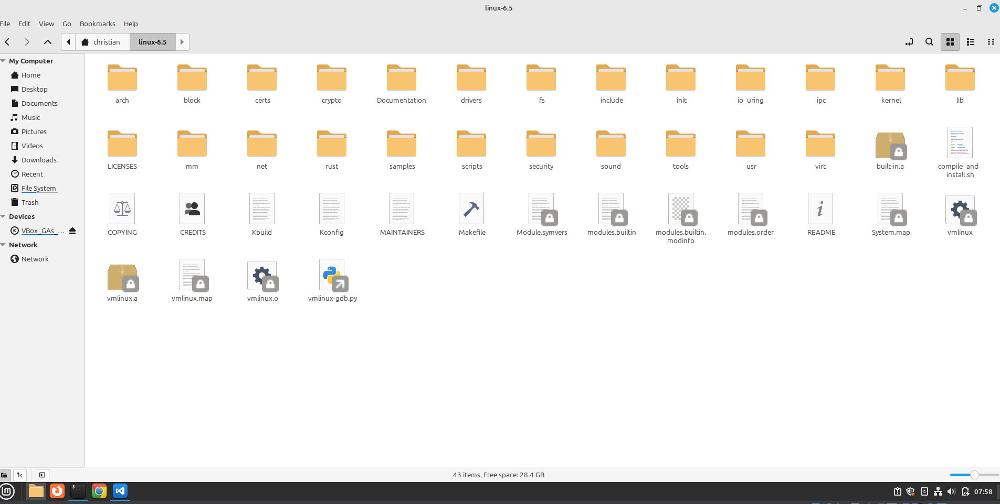
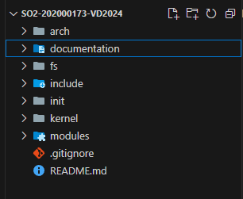
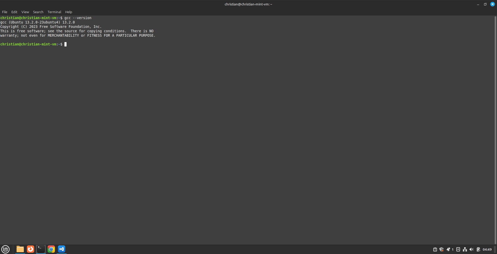
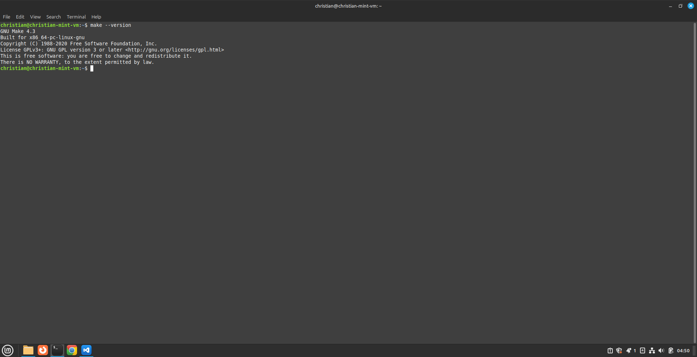
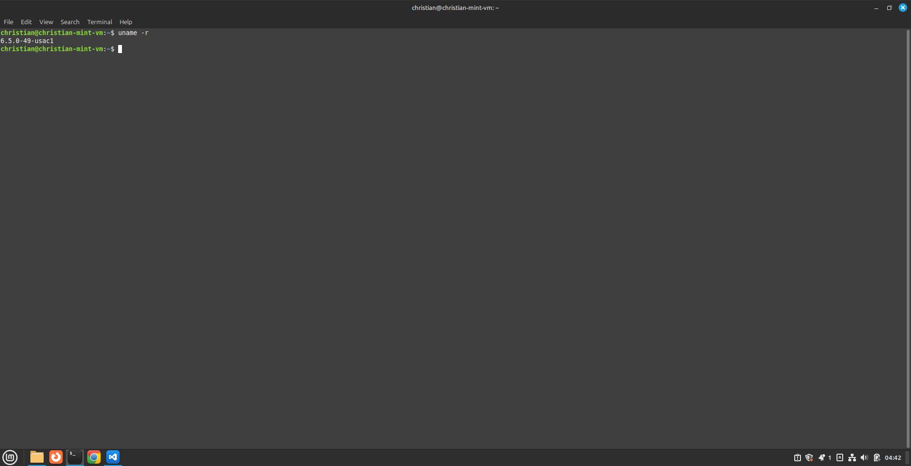
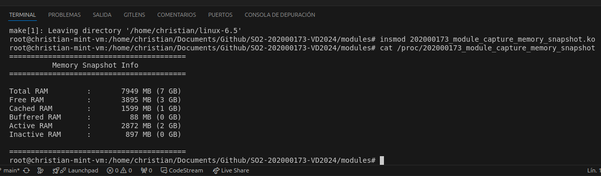
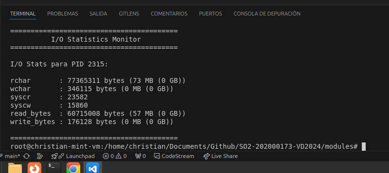
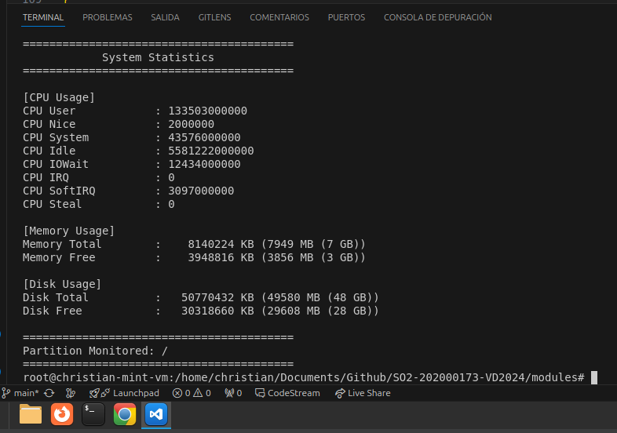

### Universidad de San Carlos de Guatemala  
### Facultad de Ingeniería  
#### Escuela de Ciencias y Sistemas  
**Curso:** Sistemas Operativos 2  
**Catedrático:** Ing. René Ornelyz  
**Auxiliar:** Brian Matus

---

# **Expansión del Kernel de Linux con Nuevas Funcionalidades**

### **Estudiante**

- Christian Alessander Blanco González (Carné 202000173)
---

## **Entorno de desarrollo configurado**


### Pasos para Compilar e Instalar el Kernel

1. **Descargar el kernel desde [kernel.org](https://kernel.org/)**  
   Archivo recomendado: `linux-6.8.tar.xz`.

2. **Descomprimir el kernel**  
   ```bash
   tar -xvf linux-6.8.tar.xz
   cd linux-6.8
   ```

3. **Instalar las dependencias necesarias**  
   ```bash
   sudo apt-get update
   sudo apt-get install build-essential libncurses5-dev fakeroot wget bzip2 openssl
   sudo apt-get install build-essential libncurses-dev bison flex libssl-dev libelf-dev
   ```

   **Nota:** Estas dependencias permiten la compilación y configuración del kernel.

4. **Cambiar a usuario root**  
   ```bash
   sudo -s
   ```

5. **Copiar la configuración del kernel actual**  
   ```bash
   cp -v /boot/config-$(uname -r) .config
   ```

6. **Limpiar el ambiente de compilación**  
   ```bash
   make clean
   ```

7. **Modificar la versión del kernel en el archivo Makefile**  
   En el archivo `Makefile` (en la raíz del código fuente), busca la línea:

   ```makefile
   EXTRAVERSION =
   ```
   
   Y cámbiala por:
   
   ```makefile
   EXTRAVERSION = -49-usac1
   ```

8. **Configuraciones iniciales**  
   ```bash
   make oldconfig
   ```
   Presiona *Enter* a todas las opciones.

   Luego:
   ```bash
   make localmodconfig
   ```

9. **Deshabilitar los certificados de firma oficiales de Canonical**  
   ```bash
   scripts/config --disable SYSTEM_TRUSTED_KEYS
   scripts/config --disable SYSTEM_REVOCATION_KEYS
   ```

10. **Compilar e instalar usando el script "compile_and_install.sh"**  
    Copia el script (por ejemplo, con `nano` o cualquier editor) y luego otórgale permisos de ejecución:
    ```bash
    chmod +x compile_and_install.sh
    ./compile_and_install.sh
    ```

    - Durante la compilación, presiona *Enter* a todas las preguntas de configuración.

11. **Instalación manual (opcional, si no usaste el script)**  
    Si el script no instala automáticamente, puedes hacerlo manualmente:
    ```bash
    make modules_install
    make install
    make headers_install
    ```

12. **Debug / Solución de problemas**  
    - Si el nuevo kernel no aparece en la lista del GRUB:
      ```bash
      sudo update-grub2
      ```
    - Al iniciar la máquina virtual, para ver el menú de GRUB, mantén presionada la tecla **Shift** al arrancar.


### Kernel utilizado
  

### Estructura base del proyecto
  

### Versión de GCC instalado
  

### Versión de Make instalado
  

---

## **Modificaciones del kernel**

- En el archivo `main.c` ubicado en la carpeta `init`, dentro de la función `void start_kernel(void)`, se modificó el mensaje que se imprime durante el inicio del kernel.

    

- En el archivo `uts.h` de la carpeta `include/linux`, se modificó la línea:
    ```c
    #define UTS_SYSNAME "Linux-sopesOS-202000173"
    ```
    Esto actualiza el nombre del sistema que reporta el kernel.

    

---

## **Implementación de Nuevas Llamadas al Sistema**


## **1. Documentación del Syscall Personalizado: `_202000173_capture_memory_snapshot`**

#### **Definición Breve**
El syscall `_202000173_capture_memory_snapshot` captura un resumen detallado del estado de la memoria del sistema, incluyendo información sobre la memoria total, libre, caché, buffers, y el uso de memoria activa e inactiva. Esto es útil para herramientas de monitoreo, depuración, o análisis del rendimiento del sistema.

### Descripción y Explicación del Código

**Dependencias:** El código incluye varios encabezados específicos del kernel de Linux para gestionar la memoria, trabajar con estructuras del espacio de usuario, y definir el syscall:

```c
#include <linux/mm.h>
#include <linux/mmzone.h>
#include <linux/vmstat.h>
#include <linux/syscalls.h>
#include <linux/uaccess.h>
#include <linux/string.h>
```

**Estructura `memory_snapshot`:** La estructura `memory_snapshot` encapsula el estado de la memoria en un momento dado:

```c
struct memory_snapshot {
    unsigned long total_ram;
    unsigned long free_ram;
    unsigned long swap_total;
    unsigned long swap_free;
    unsigned long cache_ram;
    unsigned long buffer_ram;
    unsigned long active_ram;
    unsigned long inactive_ram;
};
```

**Campos principales**:
- **`total_ram`**: RAM total disponible en el sistema.
- **`free_ram`**: RAM no utilizada actualmente.
- **`swap_total`**: Memoria total de swap.
- **`swap_free`**: Memoria de swap libre.
- **`cache_ram`**: Memoria utilizada como caché.
- **`buffer_ram`**: Memoria utilizada para buffers.
- **`active_ram`**: Memoria activa (accedida recientemente).
- **`inactive_ram`**: Memoria inactiva (no utilizada recientemente).

#### Función `fill_memory_snapshot` 
Esta función recopila estadísticas de memoria y llena una estructura `memory_snapshot` con la información obtenida:

```c
static void fill_memory_snapshot(struct memory_snapshot *snap) {
    struct sysinfo i;
    unsigned long file_pages, shmem, bufferram;
    unsigned long active_file, active_anon;
    unsigned long inactive_file, inactive_anon;

    // Obtener información sobre la memoria
    si_meminfo(&i);
    
    // Guardar valores que se usan varias veces para evitar múltiples llamadas
    bufferram = i.bufferram;    
    file_pages = global_node_page_state(NR_FILE_PAGES);
    shmem = global_node_page_state(NR_SHMEM);
    active_file = global_node_page_state(NR_ACTIVE_FILE);
    active_anon = global_node_page_state(NR_ACTIVE_ANON);
    inactive_file = global_node_page_state(NR_INACTIVE_FILE);
    inactive_anon = global_node_page_state(NR_INACTIVE_ANON);

    // Asignación de la información básica de RAM y SWAP
    snap->total_ram   = i.totalram;
    snap->free_ram    = i.freeram;
    snap->swap_total  = i.totalswap;
    snap->swap_free   = i.freeswap;

    // Cálculo de la memoria en caché
    // cache_ram = NR_FILE_PAGES - NR_SHMEM - bufferram
    snap->cache_ram = file_pages - shmem - bufferram;

    // Memoria en buffer
    snap->buffer_ram = bufferram;

    // Memoria activa e inactiva
    // active_ram = NR_ACTIVE_FILE + NR_ACTIVE_ANON
    // inactive_ram = NR_INACTIVE_FILE + NR_INACTIVE_ANON
    snap->active_ram = active_file + active_anon;
    snap->inactive_ram = inactive_file + inactive_anon;
}
```

#### Pasos principales:
1. **Obtención de información básica del sistema**:
   - Se utiliza `si_meminfo` para llenar la estructura `sysinfo`, que contiene información general como RAM total y libre, así como información sobre el espacio de swap.
2. **Valores derivados**:
   - La memoria en caché se calcula como:
     ```c
     cache_ram = NR_FILE_PAGES - NR_SHMEM - bufferram;
     ```
   - Las memorias activa e inactiva se calculan sumando los contadores de páginas:
     ```c
     active_ram = NR_ACTIVE_FILE + NR_ACTIVE_ANON;
     inactive_ram = NR_INACTIVE_FILE + NR_INACTIVE_ANON;
     ```
3. **Asignación de valores**:
   - Los valores calculados se asignan a los campos correspondientes de la estructura `memory_snapshot`.

#### Definición del Syscall
El syscall `SYSCALL_DEFINE1` realiza las siguientes acciones:

```c
SYSCALL_DEFINE1(_202000173_capture_memory_snapshot, struct memory_snapshot __user *, user_snap)
{
    struct memory_snapshot snap;

    // Llenar la estructura de snapshot de memoria
    fill_memory_snapshot(&snap);

    // Copiar los datos al espacio de usuario
    if (copy_to_user(user_snap, &snap, sizeof(snap)))
        return -EFAULT;

    return 0;
}
```

#### Pasos principales:
1. Declara el syscall con el nombre `_202000173_capture_memory_snapshot` y un único argumento: un puntero a una estructura `memory_snapshot` en el espacio de usuario.
2. Llama a `fill_memory_snapshot` para llenar una estructura local con la información de memoria.
3. Copia la información desde el espacio del kernel al espacio del usuario utilizando `copy_to_user`. Si la copia falla, devuelve `-EFAULT`.
4. Devuelve `0` si la operación se completa con éxito.

---

## Módulo: `202000173_module_capture_memory_snapshot`

**Definición Breve**: El módulo `202000173_module_capture_memory_snapshot` crea una entrada en el sistema de archivos `/proc` para mostrar un resumen del estado de la memoria del sistema. Al ejecutar el comando `cat /proc/202000173_module_capture_memory_snapshot`, se presenta un snapshot con métricas clave de memoria, incluyendo RAM total, libre, en caché, en buffers, y uso de memoria activa e inactiva.


### Descripción y Explicación del Código

### Dependencias

El código utiliza varios encabezados del kernel para manejar estructuras, el sistema de archivos `/proc`, y obtener información de memoria:

```c
#include <linux/module.h>
#include <linux/proc_fs.h>
#include <linux/seq_file.h>
#include <linux/mm.h>
#include <linux/vmstat.h>
#include <linux/uaccess.h>
#include <linux/string.h>
```

### Metadatos del Módulo

Se definen los metadatos del módulo, como el tipo de licencia, autor, y una breve descripción:

```c
MODULE_LICENSE("GPL");
MODULE_AUTHOR("KritianWHite");
MODULE_DESCRIPTION("Módulo para mostrar snapshot de memoria en /proc/202000173_module_capture_memory_snapshot");
```

### Función Auxiliar: `print_memory_line`

Esta función convierte páginas de memoria en megabytes (MB) y gigabytes (GB) para presentar valores legibles:

```c
static void print_memory_line(struct seq_file *m, const char *label, unsigned long pages) {
    unsigned long long bytes = (unsigned long long)pages * (unsigned long long)PAGE_SIZE;
    unsigned long long mb = bytes >> 20; // Dividir por 2^20
    unsigned long long gb = bytes >> 30; // Dividir por 2^30

    seq_printf(m, "%-18s: %10llu MB (%llu GB)\n", label, mb, gb);
}
```

- **Parámetros**:
  - `m`: El archivo secuencial donde se escribe el resultado.
  - `label`: Una etiqueta para identificar el valor.
  - `pages`: Número de páginas de memoria (se convierten a bytes y luego a MB/GB).

- **Salida**:
  Ejemplo de salida formateada:
  ```
  Total RAM        :       10240 MB (10 GB)
  ```


### Función Principal: `fill_mem_snapshot`

Esta función recopila y escribe las estadísticas de memoria en el archivo secuencial:

```c
static void fill_mem_snapshot(struct seq_file *m) {
    struct sysinfo i;
    si_meminfo(&i);

    unsigned long total_ram    = i.totalram;
    unsigned long free_ram     = i.freeram;
    unsigned long cache_ram    = global_node_page_state(NR_FILE_PAGES) - global_node_page_state(NR_SHMEM) - i.bufferram;
    unsigned long buffer_ram   = i.bufferram;
    unsigned long active_ram   = global_node_page_state(NR_ACTIVE_FILE) + global_node_page_state(NR_ACTIVE_ANON);
    unsigned long inactive_ram = global_node_page_state(NR_INACTIVE_FILE) + global_node_page_state(NR_INACTIVE_ANON);

    // Imprime cada valor con la función auxiliar
    print_memory_line(m, "Total RAM", total_ram);
    print_memory_line(m, "Free RAM", free_ram);
    print_memory_line(m, "Cached RAM", cache_ram);
    print_memory_line(m, "Buffered RAM", buffer_ram);
    print_memory_line(m, "Active RAM", active_ram);
    print_memory_line(m, "Inactive RAM", inactive_ram);
}
```

- **Cálculos**:
  - `cache_ram`: 
    ```c
    cache_ram = NR_FILE_PAGES - NR_SHMEM - i.bufferram;
    ```
  - `active_ram` y `inactive_ram`:
    ```c
    active_ram = NR_ACTIVE_FILE + NR_ACTIVE_ANON;
    inactive_ram = NR_INACTIVE_FILE + NR_INACTIVE_ANON;
    ```

### Función `capture_mem_show`

Esta función se ejecuta cuando el usuario lee el archivo `/proc/202000173_module_capture_memory_snapshot` con un comando como `cat`:

```c
static int capture_mem_show(struct seq_file *m, void *v) {
    seq_puts(m, "=========================================\n");
    seq_puts(m, "          Memory Snapshot Info\n");
    seq_puts(m, "=========================================\n\n");

    fill_mem_snapshot(m);

    seq_puts(m, "\n=========================================\n");
    return 0;
}
```

- **Cabeceras y Formato**:
  - Imprime cabeceras, separadores y la información formateada.

### Función `capture_mem_open`

Maneja la apertura del archivo `/proc`. Registra la función `capture_mem_show` como la encargada de mostrar la información:

```c
static int capture_mem_open(struct inode *inode, struct file *file) {
    return single_open(file, capture_mem_show, NULL);
}
```

### Operaciones del Archivo `/proc`

Define las operaciones disponibles para el archivo `/proc`:

```c
static const struct proc_ops capture_mem_ops = {
    .proc_open    = capture_mem_open,
    .proc_read    = seq_read,
    .proc_lseek   = seq_lseek,
    .proc_release = single_release,
};
```

### Funciones de Inicialización y Limpieza del Módulo

- **Inicialización**: Crea la entrada en `/proc`:
  
  ```c
  static int __init capture_mem_init(void) {
      proc_create("202000173_module_capture_memory_snapshot", 0, NULL, &capture_mem_ops);
      pr_info("202000173_module_capture_memory_snapshot: Módulo cargado. Lee /proc/202000173_module_capture_memory_snapshot\n");
      return 0;
  }
  ```

- **Limpieza**: Elimina la entrada de `/proc`:

  ```c
  static void __exit capture_mem_exit(void) {
      remove_proc_entry("202000173_module_capture_memory_snapshot", NULL);
      pr_info("202000173_module_capture_memory_snapshot: Módulo descargado.\n");
  }
  ```

- **Registro**: Conecta las funciones al ciclo de vida del módulo:

  ```c
  module_init(capture_mem_init);
  module_exit(capture_mem_exit);
  ```

#### Salida



---


## Syscall Personalizado: `_202000173_get_io_throttle`

### Definición Breve

El syscall `_202000173_get_io_throttle` permite obtener estadísticas detalladas de operaciones de entrada/salida (I/O) realizadas por un proceso específico, identificado mediante su PID. Este syscall es útil para monitorear y analizar el rendimiento I/O de procesos en un sistema Linux.


### Descripción y Explicación del Código

#### Dependencias

El código incluye encabezados específicos del kernel para trabajar con procesos, syscalls y transferencias de datos entre el espacio de usuario y el espacio de kernel:

```c
#include <linux/kernel.h>
#include <linux/syscalls.h>
#include <linux/uaccess.h>
#include <linux/pid.h>
#include <linux/sched.h>
#include <linux/sched/signal.h>
#include <linux/types.h>
```

### Estructura `io_stats_user`

Esta estructura se utiliza para encapsular las estadísticas de I/O que serán devueltas al espacio de usuario:

```c
struct io_stats_user {
    unsigned long long rchar;        // Cantidad total de caracteres leídos
    unsigned long long wchar;        // Cantidad total de caracteres escritos
    unsigned long long syscr;        // Cantidad de lecturas vía syscall
    unsigned long long syscw;        // Cantidad de escrituras vía syscall
    unsigned long long read_bytes;   // Bytes leídos del almacenamiento
    unsigned long long write_bytes;  // Bytes escritos al almacenamiento
};
```

- **Campos principales**:
  - `rchar`: Número total de caracteres leídos.
  - `wchar`: Número total de caracteres escritos.
  - `syscr`: Número total de operaciones de lectura realizadas por syscalls.
  - `syscw`: Número total de operaciones de escritura realizadas por syscalls.
  - `read_bytes`: Bytes leídos desde almacenamiento físico.
  - `write_bytes`: Bytes escritos al almacenamiento físico.

### Función Auxiliar: `get_io_stats_for_pid`

Esta función obtiene las estadísticas de I/O de un proceso dado su PID:

```c
static int get_io_stats_for_pid(int pid, struct io_stats_user *stats)
{
    struct task_struct *task;

    // Bloqueo de lectura RCU para acceder a estructuras del kernel de forma segura
    rcu_read_lock();
    task = pid_task(find_vpid(pid), PIDTYPE_PID);
    if (!task) {
        rcu_read_unlock();
        return -ESRCH; // No se encontró el proceso, retorna error
    }

    // Copiamos las estadísticas I/O del proceso
    stats->rchar       = task->ioac.rchar;
    stats->wchar       = task->ioac.wchar;
    stats->syscr       = task->ioac.syscr;
    stats->syscw       = task->ioac.syscw;
    stats->read_bytes  = task->ioac.read_bytes;
    stats->write_bytes = task->ioac.write_bytes;

    rcu_read_unlock();

    return 0;
}
```

#### Pasos principales:
1. **Búsqueda del proceso**:
   - Se utiliza `find_vpid` para localizar el proceso en la estructura del kernel mediante el PID proporcionado.
   - Si no se encuentra el proceso, retorna `-ESRCH`.

2. **Obtención de estadísticas**:
   - Las estadísticas se obtienen de los campos `ioac` de la estructura `task_struct`, que contienen las métricas acumuladas de I/O del proceso.

3. **Bloqueo RCU**:
   - Se usa `rcu_read_lock` y `rcu_read_unlock` para garantizar acceso seguro a estructuras del kernel durante la lectura.

### Definición del Syscall

El syscall está definido mediante `SYSCALL_DEFINE2` y realiza las siguientes acciones:

```c
SYSCALL_DEFINE2(_202000173_get_io_throttle, int, pid, struct io_stats_user __user *, user_stats)
{
    struct io_stats_user kernel_stats;
    int ret;

    // Obtener las estadísticas en el espacio de kernel
    ret = get_io_stats_for_pid(pid, &kernel_stats);
    if (ret < 0)
        return ret; // Retornar el error adecuado (p.ej: -ESRCH)

    // Copiar los datos obtenidos hacia el espacio de usuario
    if (copy_to_user(user_stats, &kernel_stats, sizeof(kernel_stats)))
        return -EFAULT;

    return 0;
}
```

#### Pasos principales:
1. **Obtención de estadísticas**:
   - Llama a la función `get_io_stats_for_pid` para obtener las estadísticas del proceso especificado.
   - Si ocurre un error (por ejemplo, el proceso no existe), se retorna el código de error correspondiente.

2. **Copia al espacio de usuario**:
   - Utiliza `copy_to_user` para transferir las estadísticas desde el espacio de kernel al espacio de usuario.
   - Si esta operación falla, retorna `-EFAULT`.

3. **Valor de retorno**:
   - Retorna `0` si la operación fue exitosa, o un código de error en caso contrario.

--- 

## Módulo: `202000173_module_get_io_throttle`

Este módulo del kernel de Linux permite monitorear estadísticas de I/O (Entrada/Salida) de un proceso específico mediante su PID. El módulo crea una entrada en `/proc/202000173_module_get_io_throttle` para visualizar los datos.

## Código fuente

### Inclusión de encabezados necesarios
```c
#include <linux/module.h>
#include <linux/proc_fs.h>
#include <linux/seq_file.h>
#include <linux/pid.h>
#include <linux/sched.h>
#include <linux/sched/signal.h>
#include <linux/uaccess.h>
```

### Metadatos del módulo
```c
MODULE_LICENSE("GPL");
MODULE_AUTHOR("KritianWhite");
MODULE_DESCRIPTION("Módulo para mostrar I/O stats de un PID en /proc/202000173_module_get_io_throttle");
```

### Parámetro para especificar el PID
```c
static int pid = 0;
module_param(pid, int, 0644);
MODULE_PARM_DESC(pid, "PID del proceso a monitorear");
```

### Estructura para las estadísticas de I/O
```c
struct io_stats_user {
    u64 rchar;
    u64 wchar;
    u64 syscr;
    u64 syscw;
    u64 read_bytes;
    u64 write_bytes;
};
```

### Funciones auxiliares
#### Imprimir valores en bytes, MB y GB
```c
static void print_io_bytes_line(struct seq_file *m, const char *label, u64 bytes_val) {
    u64 mb = bytes_val >> 20; // divide entre 2^20 = 1048576
    u64 gb = bytes_val >> 30; // divide entre 2^30 = 1073741824

    seq_printf(m, "%-12s: %llu bytes (%llu MB (%llu GB))\n", label, bytes_val, mb, gb);
}
```

#### Imprimir valores enteros
```c
static void print_io_count_line(struct seq_file *m, const char *label, u64 count) {
    seq_printf(m, "%-12s: %llu\n", label, count);
}
```

### Función principal para mostrar estadísticas de I/O
```c
static int io_throttle_show(struct seq_file *m, void *v) {
    struct task_struct *task;
    struct io_stats_user stats;

    seq_puts(m, "=========================================\n");
    seq_puts(m, "          I/O Statistics Monitor\n");
    seq_puts(m, "=========================================\n\n");

    if (pid == 0) {
        seq_puts(m, "No se ha especificado un PID. Use insmod con pid=[PID].\n");
        seq_puts(m, "Ejemplo: insmod 202000173_module_get_io_throttle.ko pid=0001\n");
        return 0;
    }

    rcu_read_lock();
    task = pid_task(find_vpid(pid), PIDTYPE_PID);
    if (!task) {
        rcu_read_unlock();
        seq_printf(m, "El proceso con PID %d no existe.\n", pid);
        return 0;
    }

    stats.rchar       = task->ioac.rchar;
    stats.wchar       = task->ioac.wchar;
    stats.syscr       = task->ioac.syscr;
    stats.syscw       = task->ioac.syscw;
    stats.read_bytes  = task->ioac.read_bytes;
    stats.write_bytes = task->ioac.write_bytes;
    rcu_read_unlock();

    seq_printf(m, "I/O Stats para PID %d:\n\n", pid);

    print_io_bytes_line(m, "rchar",       stats.rchar);
    print_io_bytes_line(m, "wchar",       stats.wchar);
    print_io_count_line(m, "syscr",       stats.syscr);
    print_io_count_line(m, "syscw",       stats.syscw);
    print_io_bytes_line(m, "read_bytes",  stats.read_bytes);
    print_io_bytes_line(m, "write_bytes", stats.write_bytes);

    seq_puts(m, "\n=========================================\n");

    return 0;
}
```

### Operaciones para `/proc`
#### Función `open`
```c
static int io_throttle_open(struct inode *inode, struct file *file) {
    return single_open(file, io_throttle_show, NULL);
}
```

#### Definición de operaciones
```c
static const struct proc_ops io_throttle_ops = {
    .proc_open    = io_throttle_open,
    .proc_read    = seq_read,
    .proc_lseek   = seq_lseek,
    .proc_release = single_release,
};
```

### Inicialización y limpieza del módulo
#### Función de inicialización
```c
static int __init io_throttle_init(void) {
    proc_create("202000173_module_get_io_throttle", 0, NULL, &io_throttle_ops);
    pr_info("202000173_module_get_io_throttle: Módulo cargado. Use 'cat /proc/202000173_module_get_io_throttle' con pid definido.\n");
    return 0;
}
```

#### Función de limpieza
```c
static void __exit io_throttle_exit(void) {
    remove_proc_entry("202000173_module_get_io_throttle", NULL);
    pr_info("202000173_module_get_io_throttle: Descargando modulo.....\n");
}
```

#### Macros para registrar las funciones
```c
module_init(io_throttle_init);
module_exit(io_throttle_exit);
```

### Salida



## Módulo: `202000173_module_statistics`

Este módulo del kernel de Linux permite monitorear estadísticas del sistema como uso de CPU, memoria y disco, y organiza los datos en un formato legible dentro del archivo `/proc/202000173_module_statistics`.

## Código fuente

### Inclusión de encabezados necesarios
```c
#include <linux/module.h>
#include <linux/proc_fs.h>
#include <linux/seq_file.h>
#include <linux/mm.h>
#include <linux/fs.h>
#include <linux/mount.h>
#include <linux/statfs.h>
#include <linux/sched.h>
#include <linux/sched/signal.h>
#include <linux/uaccess.h>
#include <linux/namei.h>
#include <linux/kernel_stat.h>
```

### Metadatos del módulo
```c
MODULE_LICENSE("GPL");
MODULE_AUTHOR("KritianWhite");
MODULE_DESCRIPTION("Módulo para mostrar estadísticas del sistema con un formato organizado");
```

### Parámetro para especificar la partición
```c
static char *partition = "/";
module_param(partition, charp, 0644);
MODULE_PARM_DESC(partition, "Partition to report disk usage for");
```

### Funciones auxiliares
#### Imprimir tamaño en KB, MB y GB
```c
static void print_size_line(struct seq_file *m, const char *label, unsigned long kb_val) {
    unsigned long mb = kb_val >> 10; // Convierte KB a MB dividiendo por 1024 (2^10)
    unsigned long gb = mb >> 10;     // Convierte MB a GB dividiendo por 1024 (2^10)
    seq_printf(m, "%-20s: %10lu KB (%lu MB (%lu GB))\n", label, kb_val, mb, gb);
}
```

#### Imprimir estadísticas de CPU
```c
static void print_cpu_line(struct seq_file *m, const char *label, u64 val) {
    seq_printf(m, "%-20s: %llu\n", label, (unsigned long long)val);
}
```

### Obtener información del sistema
#### Información de memoria
```c
static void get_memory_info(struct seq_file *m) {
    struct sysinfo i;
    unsigned long mem_total_kb, mem_free_kb;
    unsigned long total_bytes, free_bytes;

    si_meminfo(&i);

    total_bytes = i.totalram * i.mem_unit;
    free_bytes  = i.freeram * i.mem_unit;

    mem_total_kb = total_bytes / 1024;
    mem_free_kb  = free_bytes  / 1024;

    print_size_line(m, "Memory Total", mem_total_kb);
    print_size_line(m, "Memory Free", mem_free_kb);
}
```

#### Información del disco
```c
static int get_disk_info(struct seq_file *m) {
    struct path path;
    struct kstatfs stat;
    int err;
    u64 total_bytes, free_bytes;
    unsigned long disk_total_kb, disk_free_kb;

    err = kern_path(partition, LOOKUP_FOLLOW, &path);
    if (err)
        return err;

    err = vfs_statfs(&path, &stat);
    path_put(&path);
    if (err)
        return err;

    total_bytes = (u64)stat.f_blocks * stat.f_bsize;
    free_bytes  = (u64)stat.f_bfree  * stat.f_bsize;

    disk_total_kb = (unsigned long)(total_bytes / 1024ULL);
    disk_free_kb  = (unsigned long)(free_bytes  / 1024ULL);

    print_size_line(m, "Disk Total", disk_total_kb);
    print_size_line(m, "Disk Free", disk_free_kb);

    return 0;
}
```

#### Información de CPU
```c
static void get_cpu_info(struct seq_file *m) {
    unsigned int cpu;
    u64 cpu_stats[8] = {0}; 
    // Índices: 0:user, 1:nice, 2:system, 3:idle, 4:iowait, 5:irq, 6:softirq, 7:steal

    for_each_possible_cpu(cpu) {
        const struct kernel_cpustat *kcs = &kcpustat_cpu(cpu);
        cpu_stats[0] += kcs->cpustat[CPUTIME_USER];
        cpu_stats[1] += kcs->cpustat[CPUTIME_NICE];
        cpu_stats[2] += kcs->cpustat[CPUTIME_SYSTEM];
        cpu_stats[3] += kcs->cpustat[CPUTIME_IDLE];
        cpu_stats[4] += kcs->cpustat[CPUTIME_IOWAIT];
        cpu_stats[5] += kcs->cpustat[CPUTIME_IRQ];
        cpu_stats[6] += kcs->cpustat[CPUTIME_SOFTIRQ];
        cpu_stats[7] += kcs->cpustat[CPUTIME_STEAL];
    }

    print_cpu_line(m, "CPU User",    cpu_stats[0]);
    print_cpu_line(m, "CPU Nice",    cpu_stats[1]);
    print_cpu_line(m, "CPU System",  cpu_stats[2]);
    print_cpu_line(m, "CPU Idle",    cpu_stats[3]);
    print_cpu_line(m, "CPU IOWait",  cpu_stats[4]);
    print_cpu_line(m, "CPU IRQ",     cpu_stats[5]);
    print_cpu_line(m, "CPU SoftIRQ", cpu_stats[6]);
    print_cpu_line(m, "CPU Steal",   cpu_stats[7]);
}
```

### Funciones principales del módulo
#### Mostrar estadísticas
```c
static int system_stats_show(struct seq_file *m, void *v) {
    seq_puts(m, "=========================================\n");
    seq_puts(m, "            System Statistics\n");
    seq_puts(m, "=========================================\n\n");

    seq_puts(m, "[CPU Usage]\n");
    get_cpu_info(m);

    seq_puts(m, "\n[Memory Usage]\n");
    get_memory_info(m);

    seq_puts(m, "\n[Disk Usage]\n");
    if (get_disk_info(m))
        seq_puts(m, "Error reading disk info.\n");

    seq_puts(m, "\n=========================================\n");
    seq_printf(m, "Partition Monitored: %s\n", partition);
    seq_puts(m, "=========================================\n");

    return 0;
}
```

#### Función `open`
```c
static int system_stats_open(struct inode *inode, struct file *file) {
    return single_open(file, system_stats_show, NULL);
}
```

#### Operaciones de proc
```c
static const struct proc_ops system_stats_ops = {
    .proc_open    = system_stats_open,
    .proc_read    = seq_read,
    .proc_lseek   = seq_lseek,
    .proc_release = single_release,
};
```

### Inicialización y limpieza del módulo
#### Función de inicialización
```c
static int __init system_stats_init(void) {
    proc_create("202000173_module_statistics", 0, NULL, &system_stats_ops);
    pr_info("202000173_module_statistics module loaded. Read /proc/202000173_module_statistics.\n");
    return 0;
}
```

#### Función de limpieza
```c
static void __exit system_stats_exit(void) {
    remove_proc_entry("202000173_module_statistics", NULL);
    pr_info("202000173_module_statistics module unloaded.\n");
}
```

#### Macros para registrar las funciones
```c
module_init(system_stats_init);
module_exit(system_stats_exit);
```

### Salida 


## Archivo Makefile para la compilación de los modulos

#### 1. **Definición de objetos del kernel (`obj-m`)**
```makefile
obj-m += 202000173_module_capture_memory_snapshot.o
obj-m += 202000173_module_get_io_throttle.o
obj-m += 202000173_module_statistics.o
```

- **`obj-m`**: Es una variable especial en Makefiles para módulos del kernel. Define los archivos de objetos (`.o`) que serán compilados como módulos del kernel.
- Cada línea agrega un módulo a la lista:
  - `202000173_module_capture_memory_snapshot.o`: Este archivo representa un módulo de kernel que captura un snapshot de memoria.
  - `202000173_module_get_io_throttle.o`: Este archivo representa un módulo que monitorea estadísticas de I/O de un proceso.
  - `202000173_module_statistics.o`: Este archivo representa un módulo que recopila estadísticas generales del sistema.
- Estos módulos serán compilados en sus respectivas versiones `.ko` (Kernel Object).

---

#### 2. **Objetivo `all`**
```makefile
all:
	make -C /home/christian/linux-6.5 M=$(PWD) modules
```

- **Objetivo `all`**: Es el objetivo principal del Makefile. Ejecutar `make` sin especificar un objetivo usará este por defecto.
- **Comando `make -C /home/christian/linux-6.5`**:
  - Cambia el directorio al código fuente del kernel (`/home/christian/linux-6.5`).
  - Este paso utiliza el sistema de compilación del kernel para construir los módulos.
- **`M=$(PWD)`**:
  - `$(PWD)` representa el directorio actual donde se encuentra el Makefile.
  - Informa al sistema de compilación del kernel que los archivos fuente de los módulos (`.c`) están en el directorio actual.
- **`modules`**:
  - Es un objetivo del sistema de compilación del kernel para construir módulos de forma externa.

En resumen, este comando compila los módulos definidos en `obj-m` utilizando el árbol de código fuente del kernel ubicado en `/home/christian/linux-6.5`.

---

#### 3. **Objetivo `clean`**
```makefile
clean:
	make -C /home/christian/linux-6.5 M=$(PWD) clean
```

- **Objetivo `clean`**: Limpia los archivos generados durante la compilación.
- **`make -C /home/christian/linux-6.5 M=$(PWD) clean`**:
  - Cambia al directorio del código fuente del kernel (`/home/christian/linux-6.5`).
  - Limpia los archivos intermedios y los objetos generados para los módulos en el directorio actual (`$(PWD)`).

--- 

## CONCLUSION

Completar este proyecto fue una experiencia desafiante y enriquecedora. La personalización del kernel de Linux me permitió comprender a fondo su funcionamiento interno y adquirir habilidades técnicas avanzadas en programación de sistemas. Implementar nuevas llamadas al sistema y desarrollar módulos personalizados no solo me ayudó a profundizar en conceptos como la gestión de memoria, el monitoreo de llamadas al sistema y las operaciones de I/O, sino también a valorar la importancia de la planificación y documentación en proyectos de esta magnitud. 

## REFLEXION

Este proyecto me hizo reflexionar sobre la complejidad y la precisión que exige trabajar directamente con el núcleo de un sistema operativo. Cada modificación, desde personalizar mensajes de inicio hasta implementar syscalls avanzadas, implicó una curva de aprendizaje significativa, donde enfrenté errores, ajusté estrategias y aprendí a interpretar documentación técnica detallada. 

---